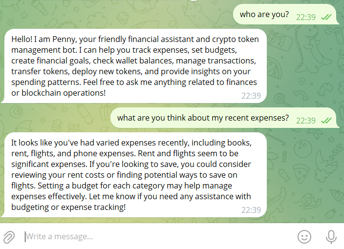
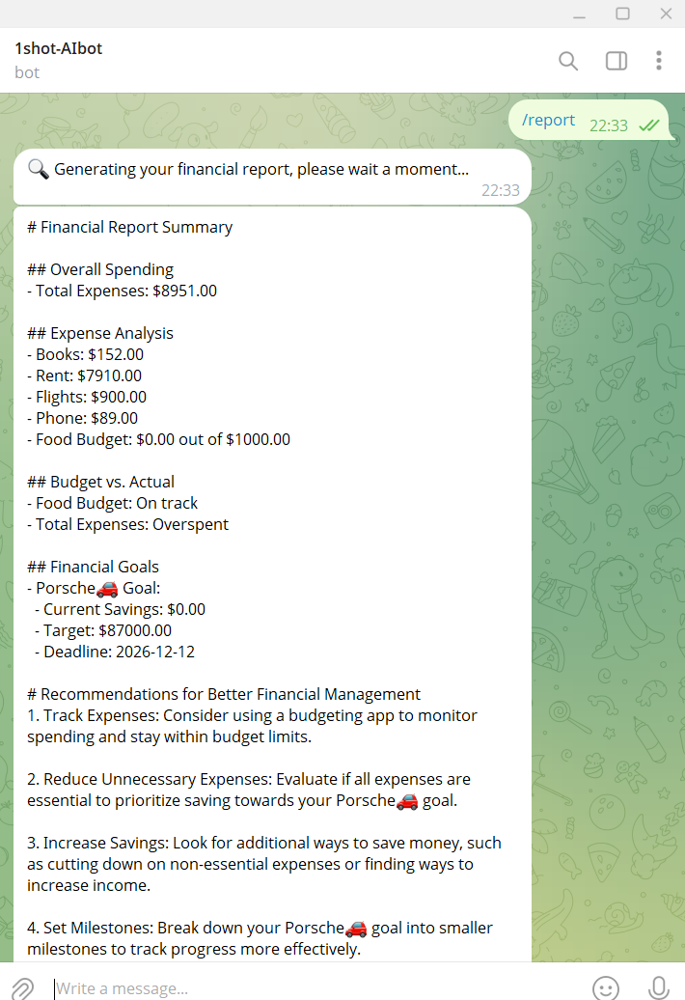
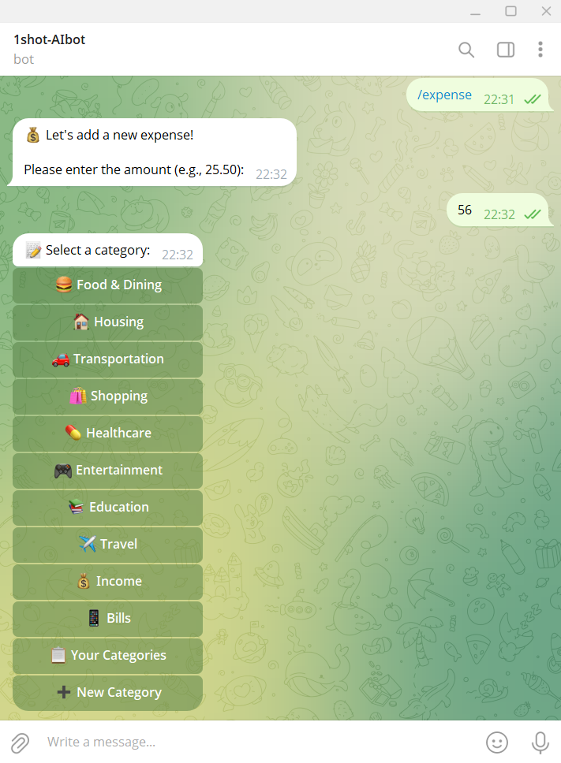
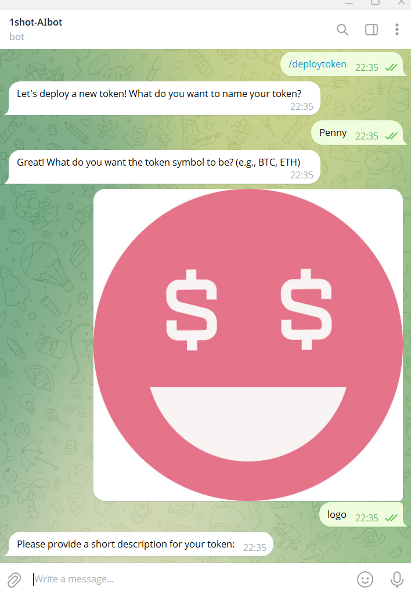
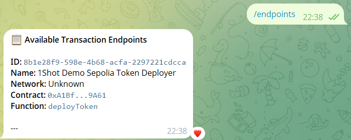
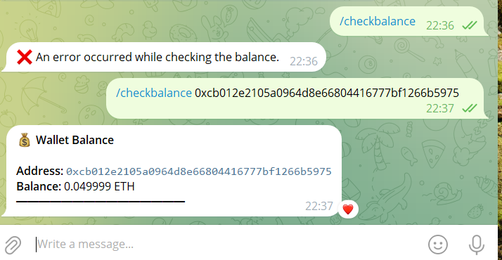
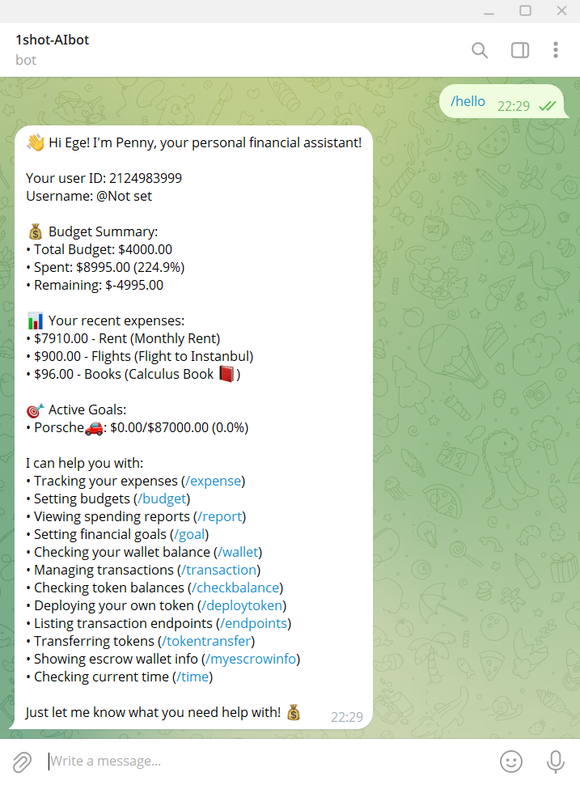

# Penny: Your AI-Powered Financial & Crypto Telegram Bot

Welcome to Penny, a sophisticated Telegram bot designed to be your personal financial assistant with powerful cryptocurrency management features. Penny is built using [python-telegram-bot](https://python-telegram-bot.org/) and the [FastAPI](https://fastapi.tiangolo.com/) web framework. It leverages the [1Shot API](https://1shotapi.com) via the [1Shot Python SDK](https://pypi.org/project/uxly-1shot-client/) for seamless blockchain interactions and [OpenAI](https://openai.com/) for intelligent chat responses and financial report generation.

Penny helps you track expenses, manage budgets and goals, and interact with blockchain assets, including token deployment and transfers. It also handles webhook callbacks from both Telegram and the 1Shot API for real-time updates.

## Features

Penny offers a comprehensive suite of features to manage your finances and crypto activities:

### 🤖 AI-Powered Assistance

- **Conversational AI Chat:** Engage in natural language conversations with Penny about your finances, crypto, or get help with its commands. Penny uses OpenAI to understand and respond intelligently, incorporating your expense data for context-aware assistance.
  

- **Financial Reports (`/report`):** Receive AI-generated summaries of your financial situation, combining data from your tracked expenses, active budgets, and financial goals.
  

### 📊 Personal Finance Management

- **Expense Tracking (`/expense`):** Easily log and categorize your daily expenses.
  

- **Budget Management (`/budget`):** Set up budgets for different spending categories and monitor your progress.
- **Goal Setting (`/goal`):** Define financial goals (e.g., saving for a purchase) and track your achievements.

### 💰 Blockchain & Cryptocurrency (via 1Shot API)

- **Token Deployment (`/deploytoken`):** Deploy your own ERC20 tokens directly through a guided conversation.
  

- **Token Transfers (`/tokentransfer`):** Securely transfer ERC20 tokens to other addresses.
- **Comprehensive Transactions (`/transaction`):**
  - Transfer native currency (e.g., ETH, Sepolia ETH) from the bot's secure escrow wallet.
  - Check the balance of the bot's escrow wallet.
  - Check the balance of any specific ERC20 token for a given address.
- **Transaction Endpoint Listing (`/endpoints`):** View a list of available 1Shot transaction endpoints configured for the bot.
  

- **Escrow Wallet Information (`/myescrowinfo`):** Display details of Penny's primary 1Shot escrow wallet, including its address, network, and balance.
- **Token Balance Check (`/checkbalance`):** A dedicated command to quickly check the balance of specific tokens (distinct from the `/transaction` menu option).
  

- **Mock Wallet Balance (`/wallet`):** Shows a mock wallet balance for demonstration purposes. (Note: This is currently a placeholder and can be expanded for real wallet integration).

### 🛠️ General Bot Utilities

- **Welcome Message (`/start`):** Initializes your interaction with Penny and provides a brief overview.
- **Detailed Summary (`/hello`):** Get a comprehensive financial snapshot, including budget status, recent expenses, goal progress, and a list of available commands.
  

- **Help Command (`/help`):** Displays a full list of Penny's commands and their descriptions.
- **Current Time (`/time`):** Check the current server time.

## How It Works

- **Telegram Bot API:** Penny uses `python-telegram-bot` to interact with users on Telegram, managing commands and conversation flows.
- **1Shot API Integration:** All blockchain operations are powered by the 1Shot API. Penny uses the `uxly-1shot-client` SDK to:
  - Manage an escrow wallet.
  - Deploy smart contracts (for token creation).
  - Execute transactions (native and token transfers).
  - Query blockchain data (balances, transaction statuses).
  - Handle webhook callbacks from 1Shot for asynchronous transaction updates.
- **OpenAI Integration:**
  - The `/report` command sends summarized financial data (expenses, budgets, goals) to OpenAI to generate a narrative report.
  - Non-command messages are processed by OpenAI to provide helpful, context-aware chat responses, using recent expense data to inform the AI.
- **FastAPI Backend:** Provides the web server to handle incoming webhook requests from Telegram and 1Shot API.
- **Database:** A local SQLite database (`penny.db`) is used to store user information, expenses, budgets, and goals.

---

### Requirements: Docker

This project requires Docker to be installed on your machine. The easiest way to get it is with [Docker Desktop](https://docs.docker.com/desktop/).

## 1. Clone the Repository

Start by cloning the repository:

```sh
git clone https://github.com/UXlySoftware/1shot-telegram-bot.git # Or your fork's URL
cd 1shot-telegram-bot
```

### `docker-compose.env` File Structure

Before proceeding, create or ensure you have a `docker-compose.env` file in the root of the project with the following structure. You will fill in the values in the subsequent steps:

```env
# Telegram Bot Configuration
TELEGRAM_BOT_TOKEN=YOUR_TELEGRAM_BOT_TOKEN_HERE

# Ngrok Configuration (for local development)
TUNNEL_BASE_URL=https://YOUR_NGROK_STATIC_DOMAIN_HERE
NGROK_AUTHTOKEN=YOUR_NGROK_AUTHTOKEN_HERE

# 1Shot API Credentials
ONESHOT_API_KEY=YOUR_ONESHOT_API_KEY_HERE
ONESHOT_API_SECRET=YOUR_ONESHOT_API_SECRET_HERE
ONESHOT_BUSINESS_ID=YOUR_ONESHOT_BUSINESS_ID_HERE
ONESHOT_NETWORK=sepolia # Or your preferred default network (e.g., mainnet)

# OpenAI API Key (Optional, for AI features)
# OPENAI_API_KEY=YOUR_OPENAI_API_KEY_HERE # See section 4 for current handling
```

Open [`docker-compose.env`](/docker-compose.env); you'll need to enter some credentials which we will walk through next.

## 2. Register a Telegram Bot

Use the [@BotFather](https://telegram.me/BotFather) on Telegram to register your bot and obtain an API Token.

Enter this token in the [`docker-compose.env`](/docker-compose.env#L4) file for `TELEGRAM_BOT_TOKEN`.

## 3. Create a 1Shot API Account & Configure

- Log into [1Shot](https://app.1shotapi.com) and create a new API key and secret from the [API Keys](https://app.1shotapi.com/api-keys) page.
- Go to the [Organizations page](https://app.1shotapi.com/organizations), click "Details" for your organization, and copy its Business ID.
- Enter these three credentials (`ONESHOT_API_KEY`, `ONESHOT_API_SECRET`, `ONESHOT_BUSINESS_ID`) into [`docker-compose.env`](/docker-compose.env#L6).
- **(Crucial)** Navigate to the [Escrow Wallets](https://app.1shotapi.com/escrow-wallets) tab in 1Shot. Create an escrow wallet for the **Sepolia Network** and fund it with some Sepolia ETH (e.g., from Google's [Sepolia Testnet Faucet](https://cloud.google.com/application/web3/faucet/ethereum/sepolia) or other faucets like [sepoliafaucet.com](https://sepoliafaucet.com/)). Penny's startup sequence verifies this.
- Set your desired default network for 1Shot operations in `docker-compose.env` via `ONESHOT_NETWORK` (e.g., `sepolia`, `mainnet`). If not set, it defaults to `sepolia` in some operations.

## 4. OpenAI API Key

- **Current Setup:** The OpenAI API key is currently hardcoded directly within the `src/aichat.py` file.
- **Configuration:** For the AI chat features to work, ensure the `openai` library is listed in `src/requirements.txt` (and thus installed in the Docker image) and that a valid API key is present in `src/aichat.py`.
- **Best Practice (Future):** For better security and configurability, especially when deploying, it's recommended to move the API key to an environment variable (e.g., `OPENAI_API_KEY` in `docker-compose.env`) and modify `src/aichat.py` to read it from there. If the key is not provided or the library is unavailable, AI features will be gracefully disabled.

## 5. Ngrok for Webhook Tunneling

Penny needs to receive webhook callbacks from Telegram and 1Shot API. [Ngrok](https://ngrok.io) provides a tunnel for this during local development.

- Create a free Ngrok account and register a static domain on the [Domains tab](https://dashboard.ngrok.com/domains).
- Enter this static URL (e.g., `https://your-static-domain.ngrok-free.app`) into [`docker-compose.env`](/docker-compose.env#L13) for `TUNNEL_BASE_URL`.
- Get your Ngrok auth token from the ["Your Authtoken" tab](https://dashboard.ngrok.com/get-started/your-authtoken) and add it to `docker-compose.env` as `NGROK_AUTHTOKEN`.

## 6. Build the Docker Image

Build the Telegram service container image:

```sh
docker compose build telegram-service
```

## 7. Run the Bot Stack

With all environment variables set in `docker-compose.env`, run the application stack:

```sh
docker compose --env-file docker-compose.env up -d
```

- Monitor webhook traffic via the [Ngrok agent dashboard](http://localhost:4040) (available if the Ngrok container is running).
- The `src` directory is mounted into the bot's container. For code changes, restart the service:
  ```sh
  docker compose restart telegram-service
  ```
- For changes to `docker-compose.env` or `docker-compose.yaml`, run `docker compose down` then `docker compose --env-file docker-compose.env up -d`.

## 8. Stream Logs

View your bot's activity in real-time:

```sh
docker logs -f telegram
```

## 9. Interact with Penny!

Your bot should now be live on Telegram! Start a chat with it and try the `/start` or `/hello` command to see Penny in action. Explore its financial management tools, crypto features, and AI chat capabilities.


_(Consider updating this GIF to showcase Penny's new features!)_

---

## Ideas for Production Bots

[Firestore](https://firebase.google.com/docs/firestore) and [Cloudflare D1](https://developers.cloudflare.com/d1/) are great options for database technologies for running production Telegram bot applications with non-trivial amounts of users. They also have generous free usage tiers.

While this starter repo is setup with Ngrok tunneling so that Telegram and 1Shot API can reach your bot for webhooks when running from your laptop, [Cloud Run](https://cloud.google.com/run), [Digital Ocean Droplets](https://www.digitalocean.com/products/droplets), and [Cloud Workers](https://developers.cloudflare.com/workers/languages/python/packages/fastapi/) are also great options for hosting that also have good free tiers.

You should also remember that onchain transaction cost money in the form on network funds, so you'll want to think about how and what to charge users for so that you can make enough to pay for operating you bot! Telegram has a built in platform currency called [Stars](https://telegram.org/blog/telegram-stars). Billing users in Telegram Stars helps build trust due to its convenience and their security as it doesn't require them enter billing details into a new application or connect their wallet to an unknown web application.
